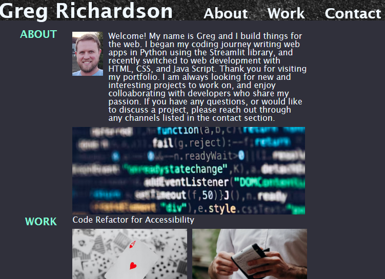

# My-Portfolio

## Description
This is my portfolio website, to be updated as I learn and grow as a developer. It is where I will showcase my best work, most recent projects, and favorite things to work on.

## Features
* Home: A clean landing page that provides an overview of my abilities.
* About: A section about my background and coding journey.
* Work: A showcase of my past projects, with links to live websites.
* Contact: Contact information, including links to my GitHub and LinkedIn pages.

## Link to site
### [My Portfolio](https://gsr142.github.io/My-Portfolio/)

## Lessons Learned
* Wireframing before building would have made this much easier. I didn't learn about wireframing until the project was 90% complete, so I did everything the hard way.
* The Flexbox is a great tool. It isn't the solution to every problem though.
* If the source images are all the same size, it is much easier to make them display the same size on the page. 
* Putting a border around every element makes it much easier to visualize how each element on the page interacts with the surrounding element. Just remember to remove it before deployment.

## Tools Used
* [HTML](https://developer.mozilla.org/en-US/docs/Web/HTML)
* [CSS](https://developer.mozilla.org/en-US/docs/Web/CSS)
* [Git](https://git-scm.com/)
* [Free Images](https://unsplash.com)
* [css-tricks.com](css-tricks.com)

## Credits
### Navigation Bar background photo
* Photo by: [Ryan Moreno](https://unsplash.com/@ryanmoreno)
* Published June 5, 2016
* Free to use under the Unsplash License

### Tipout Calculator link photo
* Photo by: [Jessie McCall](https://unsplash.com/@littlegreeneyes)
* Published May 5, 2020
* Free to use under the Unsplash License

### Code Refactor Link Photo
* Photo by: [Markus Spiske](https://unsplash.com/@markusspiske)
* Published December 20, 2019
* Free to use under the Unsplash License

### OFC Calculator Link Photo
* Photo by: [Amirali Mirhashemian](https://unsplash.com/@amir_v_ali)
* Published March 9, 2018
* Free to use under the Unsplash License

### Fantasy Football Site Photo
* Photo by: [Ben Hershey](https://unsplash.com/@benhershey)
* Published October 18, 2017
* Free to use under the Unsplash License

### Weather App
* Photo by: [Raquel Pedrotti](https://unsplash.com/@raquelpedrotti)
* Published August 20, 2019
* Free to use under the Unsplash License

## Code Credit
The reset.css file was taken from the UC Berkley Coding bootcamp lecture materials, from the section discussing CSS-resets. I did not author this file.

## Author
### Greg Richardson

## Contact
* gsr142@gmail.com
* [GitHub](https://github.com/gsr142)
* [LinkedIn](https://www.linkedin.com/in/gregory-richardson-7bb3a1280/)
